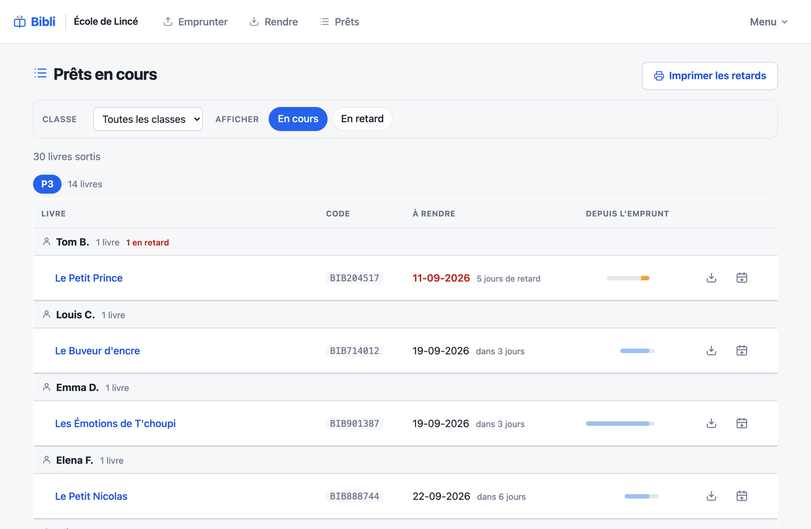
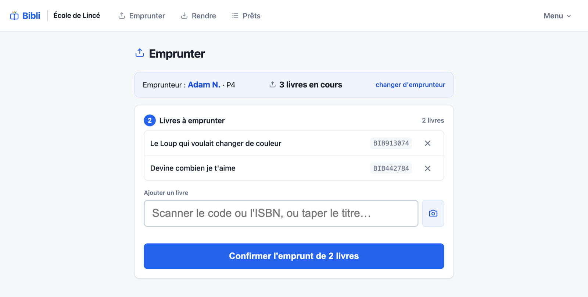
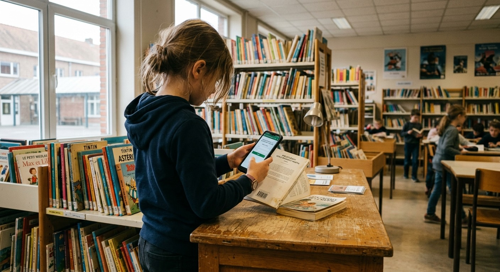
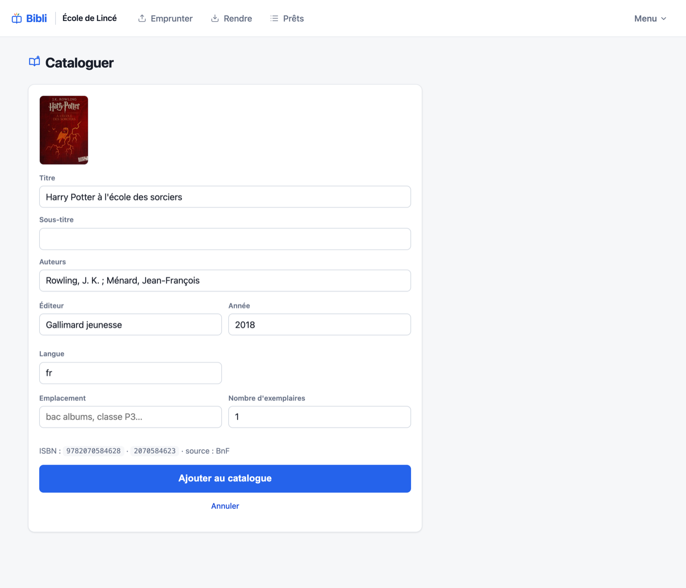
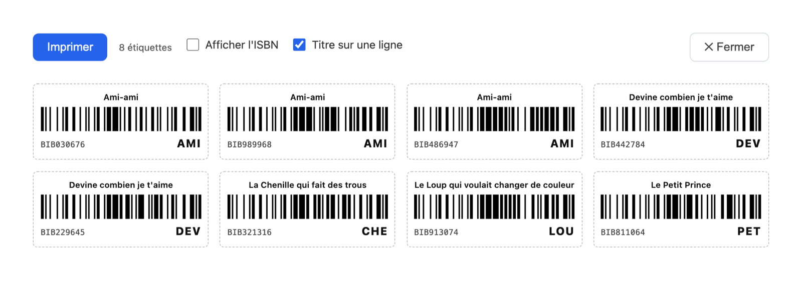
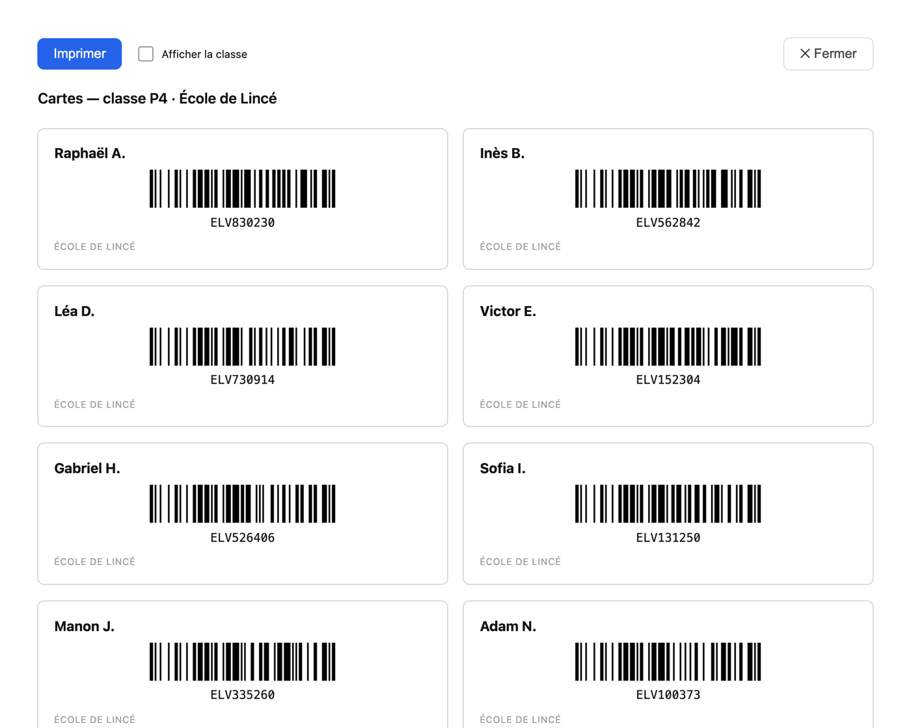
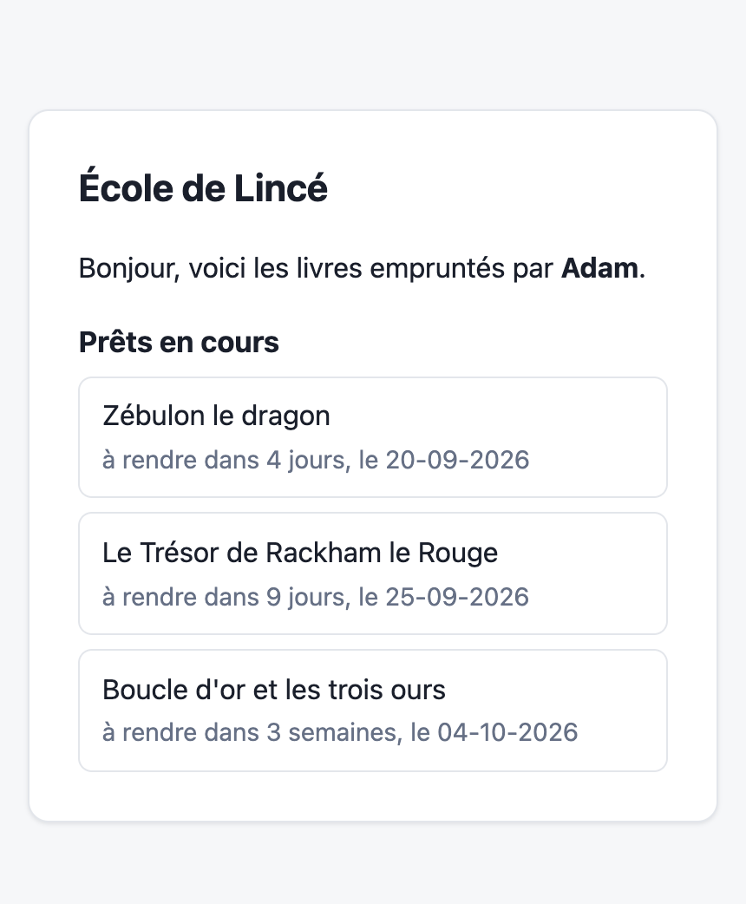

**Bibli** is a small application written for the library of the school of Lincé, in French-speaking Belgium: about two thousand books, two hundred pupils, a few dozen loans a week. It is run by teachers and volunteers, and there is no IT staff on site.

That last sentence decided the technical choices for this project. I tried to stick to one question: what breaks in five years if nobody touches it? A Go binary, a SQLite file, the standard library, HTMX for the interactive bits — all of it committed to the repository, no CDN, one production dependency. Nothing original, which is rather the point: backing up means copying a file.

## At the desk

A loan is recorded with a €30 USB barcode scanner, which behaves like a keyboard, or with the camera of a phone or tablet. Scan the pupil's card, then the books. The screen recalls what the child already has out, and flags any overdue book before another one is handed over. A return needs nothing but the book's barcode.

The scanner stays faster, though, than a phone held by an eight-year-old.

## The ISBN, and its second form

This is where I got it wrong first. The barcode on the back of a book is always an EAN-13, but books published before 2007 were catalogued under ISBN-10, and many records are indexed only in that form. Querying a catalogue with the scanned value alone leaves out part of the collection — the older part, which is most of a school library.

So Bibli works out both forms and queries with both: the [BnF](https://www.bnf.fr) first, then [UniCat](https://www.unicat.be) for Belgian editions, Google Books and Open Library after that. The record comes back pre-filled, you correct it, you say how many copies.

In my tests, three to seven per cent stay unresolved — picture books, small publishers, older titles. So manual entry is one click away, and it is not a fallback: it is a normal path.

Labels print four to the width of an A4 sheet, with the shelf mark taken from the title. Borrower cards print by class.

## As little data as possible

This is data about children, so the app records a first name, a last-name initial and a class. Nothing else: no date of birth, no address, no email, no photo. "Durant" becomes "D.". If the database ever leaks, it stays barely identifying.

Loan history says a lot about a child, though: past an adjustable delay — three years by default — returned loans are reassigned to an anonymous borrower. The link between the child and their reading disappears, the book keeps its count.

Parents have no accounts: a secret per-pupil link, handed out in person, shows what the child has out. Nothing is sent, no address is stored.

And only an ISBN ever leaves the school: covers are fetched by the server, never by a pupil's browser.

## What I did not build

No reservations, no public catalogue, no automatic emails to parents, no pupil accounts, no fines. Less out of principle than out of caution: every extra screen is a screen to explain to someone who did not ask for it, and to repair when I am no longer around.

The application has not really been used yet. The real questions — how long a loan should run, how many books at a time, what to do with a lost book — are waiting on a few weeks of actual use, and will probably be settled differently from what I assumed.

It is free software under the AGPL-3.0; the repository will be opened shortly.

If another school would like to try it, or if you have a remark on the way it is built, let me know. What interests me most is hearing what turns out to be missing once real pupils are in front of it.
