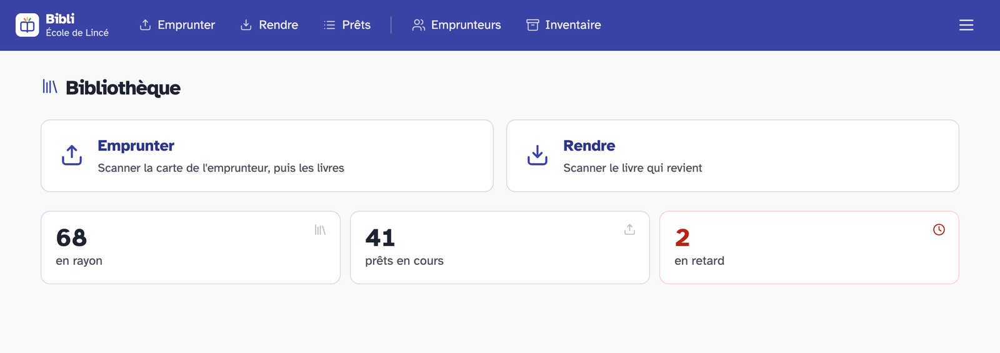
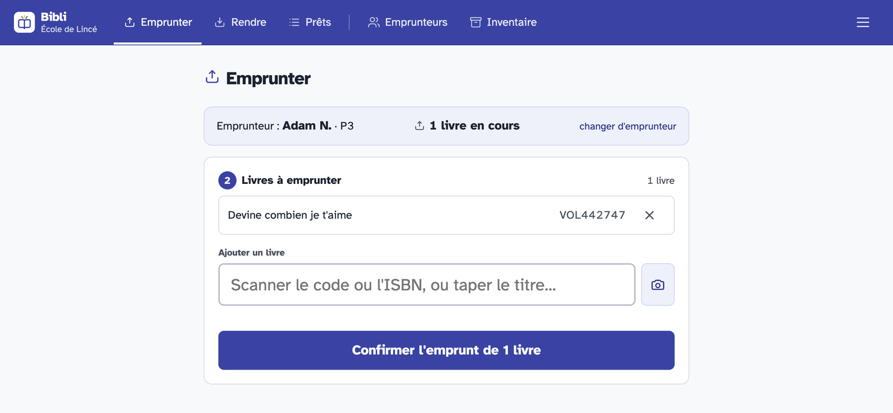
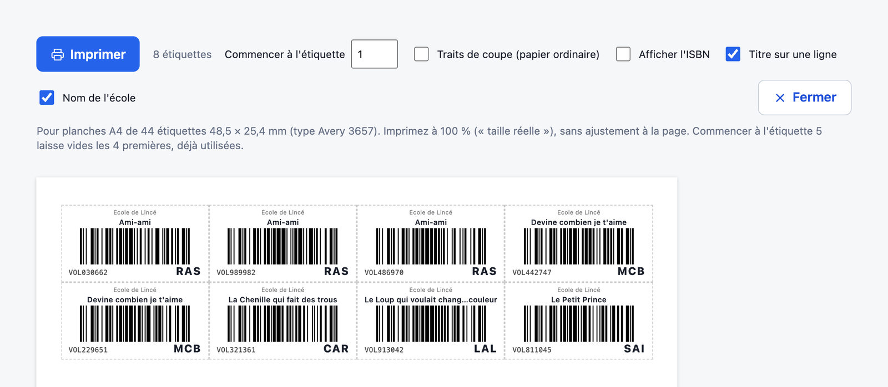
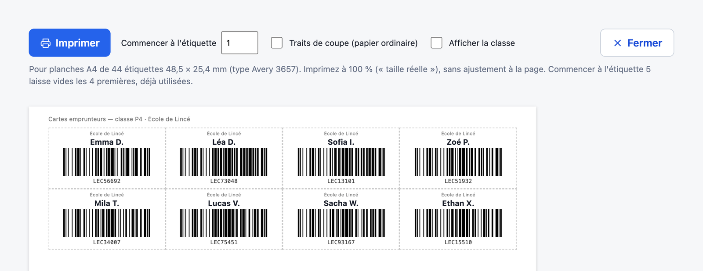
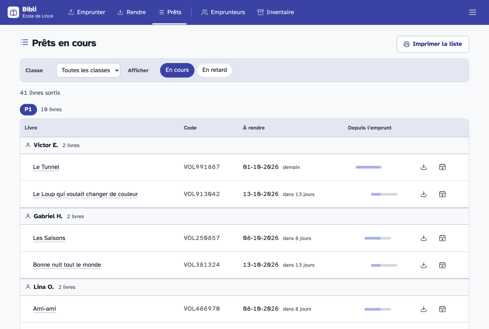

**Bibli** is an application for a school library. I wrote it for the library of the school in Lincé, in French-speaking Belgium: about two thousand books, two hundred pupils and a few dozen loans a week. It is run by teachers and volunteers, with no IT staff on site.

It lets them lend and return books with a barcode scanner, catalogue a book by scanning its ISBN, print labels and pupil cards, and keep track of overdue books. The interface is available in French, Dutch and English.

A two-minute walkthrough, on made-up data:

There is also a [live demo](https://bibli.tintamarre.be) (password `demo`): a fictional school where you can try everything, reset regularly.

## At the desk

The desk has two screens: *Borrow* and *Return*. To lend, you scan the pupil's card, then their books, and confirm once for the whole basket. The screen shows what the child already has out. To return, you just scan the book.

An entry-level USB scanner, around €30, does the job: it behaves like a keyboard and needs no setup. The camera of a phone or tablet works too. If a pupil has forgotten their card, you type their class and the start of their first name ("P3 lé"). If a label won't scan, a few words of the title are enough.

## Cataloguing

You scan the ISBN on the back of the book and Bibli queries the catalogues: the [BnF](https://www.bnf.fr), [UniCat](https://www.unicat.be) for Belgian editions, then Google Books and Open Library. The record comes back pre-filled with title, authors, publisher and cover. You check it, enter the number of copies and, if you like, a location ("Picture books 3–5", "class P3").

A book's barcode is an ISBN-13, but many books published before 2007 are known to catalogues only by their old ISBN-10. So Bibli works out both forms and searches with both, which makes a real difference for older books.

About one book in ten isn't found anywhere: picture books for toddlers, small publishers, old titles. Manual entry covers them, and only the title is required. An unknown book scanned at the desk can also be catalogued on the spot and lent straight away.

## Labels and cards

You can do without labels and lend by ISBN alone. Labels help with books that have no barcode and with titles the library owns several copies of. They print on A4 sticker sheets of 44, with a barcode, the title and the shelf mark. The shelf mark is the first three letters of the author's surname, as in public libraries: SAI for Saint-Exupéry.

Pupil cards print by class, on the same sheets. Printed on plain paper, a class's page becomes a sheet to keep at the desk for forgotten cards.

## Through the year

The *Loans* screen lists what is out, class by class. Overdue books print as a list grouped by class, to hand out to each classroom.

The inventory lists every copy with its location and condition (damaged, lost, withdrawn). Sorted by shelf mark, it follows the order of the shelves. The statistics show the most borrowed books and the ones that have never left the shelf. At the start of the school year, a single screen moves each class up a year, and the list of new pupils is imported from a spreadsheet.

## Children's data

For a pupil, Bibli records a first name, a surname initial and a class, nothing more: type "Durant" and only "D." is kept. After three years by default (the delay can be changed), past loans are no longer linked to the child. The books keep their loan counts.

If the school wants it, each family can get a personal link that shows the child's current books and their due dates. Parents don't need an account, and Bibli sends no messages.

When Bibli looks up a record, only the book's ISBN leaves the server. Covers are fetched by Bibli itself, never by a pupil's browser.

## Installing

There are two ways to install it. For a library with a single computer, a desktop app for Mac, Windows or Linux downloads and opens with a double-click. For several computers or tablets, Bibli can run as a server on the school network or on the Internet. An old PC or a Raspberry Pi is enough.

Under the hood, it is a Go binary and a SQLite file, with HTMX for the interactive parts. The application serves everything itself: no CDN and no account to create. Lending and returning work even without an Internet connection. A backup is made every day, and you can download it from the settings.

Bibli is free software under the AGPL-3.0. The code and documentation are at [github.com/tintamarre/bibli](https://github.com/tintamarre/bibli).

The school is only just starting to use it. If another school would like to try it, or if you have a remark, let me know.
