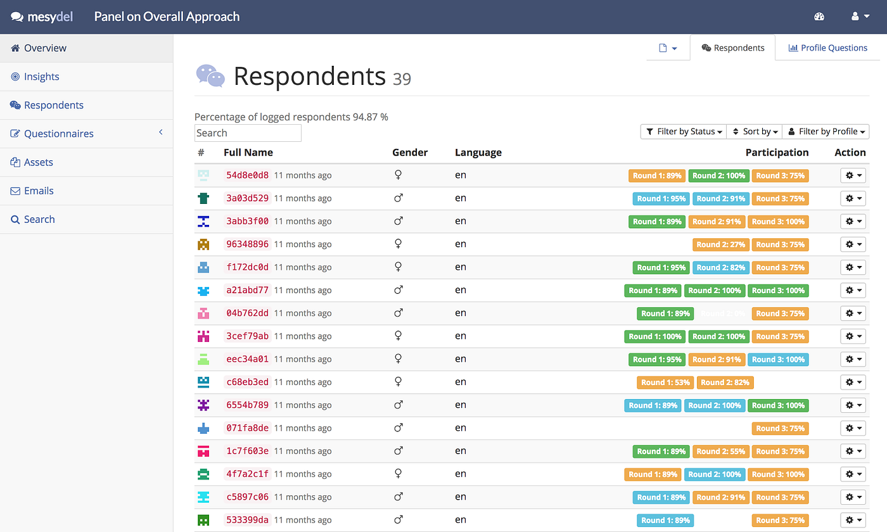
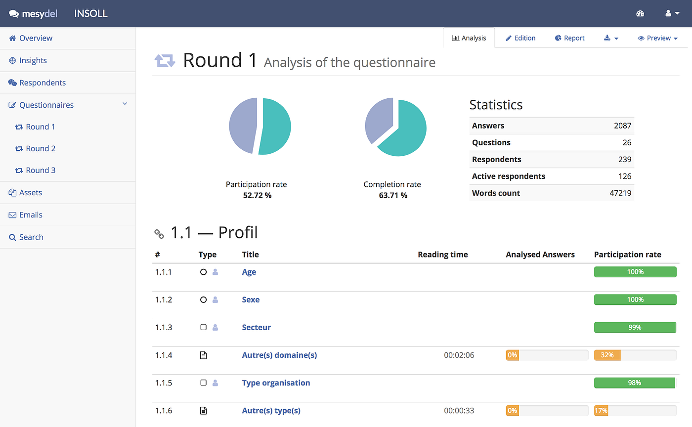
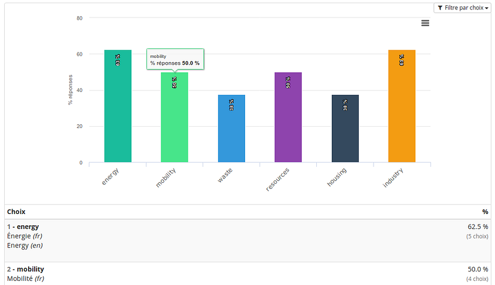

**Conducting an online Delphi survey**

Originally, the mediation method known as the Delphi method is a paper-based method. This method makes it possible, with a process in several rounds, to obtain a list of positions — and even a consensus — by questioning a panel of experts of a given field. Between each round, the mediator draws conclusions, then launches a new round with questions inspired by these conclusions. At the end of the process, a report is prepared detailing the positions.

In a typical procedure, these questions are sent by mail, fax or e-mail. Answers pass through the same channels. Very soon, the mediator finds himself drowned under the responses of different sources, so that he loses considerable time in organization. Having a difficult access to related answers also makes the analysis more tedious — and ultimately produces an unsatisfactory outcome. The constraints are also on the side of the expert, obliged to fill out obsolete forms within the time limit, which leads to a relatively low turnout.

The Mesydel platform, developed within the Spiral unit of the University of Liège, responds to these weaknesses. The purpose of a Mesydel session is to collect and analyse**a set of positions**, through anonymous online iterative consultations of an expert panel. These consultations, depending on the objective and the field investigated, make it possible to **document a consensus or a dissents** on one or more questions, to **anticipate a trend** or to**co-construct a shared vision** (e.g. participatory management / design).

Mesydel is a tool that frees the analyst from many constraints related to the implementation of the method: it formalizes the various steps of the survey in a semi-sequential manner. As a result, it encourages the researcher to respect a set of good practices, while leaving flexibility and great organizational freedom. It should be noted that Mesydel is not a strict implementation of the Delphi method, but an original methodology adapted to the needs of contemporary research in the humanities and social sciences. It exploits in a radically innovative way the possibilities offered by new information technologies. The fine balance between scientific rigour and flexibility, as we shall see, results in **faster results of higher quality**, while leading the researcher to avoid certain pitfalls.

## **The Mesydel platform: institutional origin**

In 2008, the Spiral research centre (Department of Political Science, University of Liège) developed a software tool to facilitate the implementation of the Delphi method. As the Spiral carried out extensive research in the social and political sciences, the Delphi method was already a highly sought-after method that was able to complement other data-gathering techniques such as focus groups, qualitative interviews or scenarios workshops. As the technique was deployed remotely, in the written form and anonymously, a Web translation appeared natural. The originality of the Mesydel application mostly come from the will of the researchers to develop **a tool that manages the integration of various tasks and phases of the Delphi method: from purely logistics to analytical process.**

The first Mesydel prototype, developed by Stéphane Rieppi and Martin Erpicum, is the result of needs arising from a doctoral research project, a Delphi survey on the desirability of creating a Technology Assessment service in Wallonia. **The success of this first experiment, perceived among the interviewed panel and the researchers at the controls, encourage them to pursue the project on the long run.** From a first rudimentary application entirely customized for the first project, Mesydel has evolved, and continues to evolve, according to the needs expressed by researchers or analysts, as well as the reflection on the tool by Spiral researchers. In 2017, Mesydel has got its third software version, following the experience gained from around forty projects for academic, public or private partners.

## **Description of the web application**

Mesydel is therefore an integrated web application that can **accompany the researcher in all the stages of an online Delphi survey:**

- definition and creation of a new survey,
- management of the profiles of potential respondents,
- writing the online questionnaire,
- launch of e-mail invitations,
- analysis of the collected data (these last three steps are repeated in Delphi iterations).

In order to guarantee the quality and reliability of the research, particular attention has been paid to the realization of a simple, fast and efficient interface for both the researcher and the interviewed panel. Most often, these functionalities are all used, in order to ensure maximum consistency in the research carried out. But it is nevertheless possible to ensure some of the actions outside the software. The flexibility of the tool allows its use in implementation of other methodologies than the Delphi’s, such as a classic questionnaire in a single round (satisfaction surveys for example).

### Fluidized logistics

Because it centralizes the logistics and analytical tasks of the method within a single platform, this online Delphi method offers many benefits.

In terms of logistics,**communication is simpler and more direct with participants**. The fine selection of the respondents makes it possible to target the invitation, reminder or thanks messages. Updating the database is facilitated and centralized, while the progress of the questionnaire and response rates are live monitored. Participants have permanent access to the server and can choose to complete their answers at any time during the tour. Finally, it is possible to extend deadlines while notifying it to participants.

**Language barriers are also removed in Mesydel.** The language of the interface can be chosen according to the respondent’s preferences and skills. It is also possible to respond in the language he/she wishes, whenever the researcher speaks the language. Researchers, in turn, will be able to use the Mesydel tools in the language of their choice.

All of these logistical features generate a**much higher participation rate than traditional methodologies**because they facilitate the involvement of the respondents and simplify the work of the moderator. The content generated is ultimately more important and of better quality, since the participants have the possibility to connect, to review and to modify their answers unlimitedly until the deadline. The attrition rate, that is to say drop-outs from tour to tour, is also weaker thanks to the online method and the personalized reminders. In addition, many surveys are difficult to conduct due to spatial or temporal constraints. Computerization and data centralization greatly reduces these constraints, allowing participants to complete questionnaires at different times of the day, regardless of location or time. Finally, a number of ergonomic safeguards make it almost impossible for the analyst to have manipulation errors: in addition to a user-friendly interface deliberately drawn as a word processing tool, an automatic backup system makes it virtually impossible to loss the answers entered.

### Qualitative analysis tools

Let us now look at the functionalities developed for the analysis of the answers collected. Following the different possible types of questions, the analysis tools integrate qualitative, quantitative and mixed approaches. The software makes it possible to carry out useful displays of information on the whole collected corpus: display of all the answers of a respondent or of respondents from a certain socio-professional category; display of all responses to the same question, respondent per respondent; display of all the answers qualified in a certain way by the analysts by the apposition of “Tags” or “Facets”, etc.

The **qualitative responses analysis tools** seamlessly combine and mix elements of the social web (“folksonomies”) (Peters, 2009) and of Computer Assisted Qualitative Data Analysis Software (CAQDAS) (Lejeune, 2010). These tools allow the researcher, for example, to evaluate the answers according to their immediate interest, or to indicate the current state of their treatment. A text field also allows to annotate the answer, as would do a notepad.

But also, and most importantly, they give the possibility to define “Tags” to label every idea or concept that it detects in a response. It is then possible to organize these tags in “Facets” grouping tags of the same nature. For example, in a questionnaire on tastes and colours, the red, green and blue tags will be in the “Colours” facet, while bitter, sweet and salty will be associated with the “Tastes” facet. The visualization of clouds of tags and facets produced provide the researcher with a structure, or even a first skeleton, of his final analysis document. He might decide, for example, that each facet would be a section of his conclusions, a section within which the tags that become intelligible concepts would be discussed, in similar proportions to their actual presence in the total received answers.

An important feature of these analysis tools lies in their plasticity: they have been developed to facilitate the work of the researcher, but their use is not made necessary and they do not constrain the researcher to analyse its corpus with a predetermined methodology. Mesydel is then able to serve as a technical support for the mobilization of techniques resulting from various methods, such as those derived from Grounded theory methodology (G. Glaser, AL Strauss, 1967) or collective hermeneutics (Molitor, 1990 ). It encourages the researcher to use the various sorting and annotation systems with creativity. It does not impose a way to use the analysis system in a predefined way.

The general approach is that the researcher remains close to his data. The analyses emerge from the content and not the reverse. The system of tags and facets avoids two very common biases that arise when transversally reading a large number of answers:

- **Partiality bias:** thanks to tagging, the researcher fades in the face of the diversity of opinions. Criteria such as personal affinities with the ideas of a specific expert or the quality or mediocrity of another’s prose are easily avoided when the importance and recurrence of a given tag is graphically visualized.
- **Involuntary omission bias:** it is extremely difficult, during a transversal reading, to capture all the ideas that appear in the corpus. It is not uncommon to see an external person reread the raw data of the researcher and find in data ideas that simply escaped him. Here again, the “tagging” of the answers makes it possible to bring out the ideas in a much more systematic and exhaustive way.

### Quantitative analysis tools

The **quantitative analysis** tools of Mesydel, for their part, closely correspond to the nature of the questions. Quantitative analysis is facilitated by the visualization of responses and instant generation in graphs. Single- or multiple-choice questions generate bar graphs or pie charts. Numerical questions generate statistical curves. All these data can be easily exported to statistical analysis programs for further processing.

Thus, the Mesydel tool allows the collection and analysis of **qualitative and quantitative data** on the same corpus of data and in a single iterative collection process. The functionalities developed for the Mesydel software not only improve logistics but also improve the quality of the results and of the analysis of the survey. The platform’s built-in tools — tagging, graphics, annotations, or the automatic export of reports or spreadsheets — simplify the analysis of collected data and save valuable time for the survey moderator.

More specifically, the centralization of the information and the visualization tools of the platform make it possible to contextualize the raw data in three different ways:

- **By approaching a population as a whole:** in the case of a panel composed of a heterogeneous population, the researcher approaches the various positions in a comprehensive way, analysing the distribution of the various positions within the population and the possible reasons explaining this distribution.
- **By approaching a specific individual:** a respondent can be analysed in terms of the answers he gave over the questions and the iterations, his positions and his trajectory. What is its propensity for abstention or marginal positioning? Does he easily agree with the majority? Is there a privileged angle of approach? This is a typically qualitative questioning of the Delphi method, facilitated by Mesydel.
- **By identifying and understanding the links between actors and representations:** certain links can be traced between certain sub-populations and certain positions. In particular, there may be relationships between types of occupation, hierarchies, and particular positions. Mesydel facilitates the way these links can be described and interpreted. The centralization of information reveals central explanatory elements in the way these different representations and definitions have been forged.
