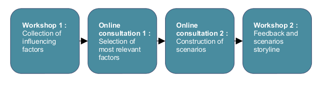

The **Institute of Environment and Sustainable Development (IMDO)** of the University of Antwerpen needed to conduct a foresight interdisciplinary exercise to explore possible long-term energy scenarios. The objective was to integrate insights on energy system dynamics from engineering, economics, policy science, sociology and ethics. To implement this exercise and to facilitate the participative aspect of the project, a partnership with Mesydel was set up:

- Consensus on the 20 most important factors impacting energy system development
- Interdisciplinary co-construction of 3 long-term energy scenarios
- Exploration of new energy trajectories to achieve a set of 8 objectives for 2050
- Assessment of the consequences and implications of these scenarios by a multi-criteria assessment framework

## Our partner

The **Institute of Environment and Sustainable Development (IMDO)** of the University of Antwerpen is the main coordinator of the research project *SEPIA, Sustainable Energy Policy Integrated Assessment — A normative contribution to decision support*. The SEPIA project took place from January 2008 to December 2010. The research center IMDO offers multidisciplinary research and education programs that aim to support the complex challenges of society, industry and authorities on sustainability questions. The interdisciplinary nature and the need of co-construction in this foresight exercise made Mesydel essential to facilitate the participatory phase of the SEPIA project.

## Context

In common with all industrialised nations, Belgium is currently locked into an energy and carbon intensive economic system. The most important energy technologies, institutions, infrastructure and networks have evolved in this particular context. Keeping this in mind, achieving a sustainable and low-carbon energy future will **require** **new ways of thinking** about the energy system, levels of demand for energy services and how this demand should be met.

This in turn requires the development of long-term energy scenarios, which are needed to support the development of well-founded and coherent policy decisions, to direct long-term investments, and to anticipate the necessary societal change. This represents a huge challenge requiring **strategic scientific information**. This scientific support for decision making on sustainable development is quite different than the traditional science for policy, because of its normative character, the inseparable connection with deep-rooted value patterns and the long-term nature of most relevant development. It needs to imply a large panel of societal and scientific actors.

The SEPIA project addresses such needs in the field of long-term energy policy. It is an interdisciplinary project aiming at integrating insights on energy system dynamics from engineering, economics, policy science, sociology and ethics. The objective was to come up with **possible long-term scenarios for the future of energy policy**, each of them reaching a set of 8 sustainability objectives for 2050.

Although part of the project results are contingent on specifics of the Belgian context, the project is embedded in the wider context of European and global energy system governance debates.

## Mesydel intervention

For the foresight exercise, two groups of participants were created: a Scenario Builder Group (SBG) and a Stakeholder Panel (SHP). The methodology involved 4 main steps. Mesydel was used in the second and third steps to choose/classify factors and construct scenarios skeletons with the Scenario Builder Group.

1. **Collection and elaboration of factors influencing energy system development:** A first workshop with the SBG and SHP panels leads to the definition and exploration of 50 major factors having an impact on energy system. Among these 50 factors, the 22 most important were selected, regarding the development objectives fixed for 2050.
2. **Internet consultation for the selection of 6 most influential factors:** the online consultation was conducted with the SBG group. It was used to achieve a cross-impact analysis of interdependencies between factors, using a 22x22 matrix. Factors were then classified depending on their relations to others: determinant, strategic, regulatory, dependent or autonomous factors. 6 factors were selected based on this first classification.
3. **Co-construction of scenarios with the Scenario Building Group:** A second round of questions allowed a co-construction of scenario skeletons using these 6 most influential factors. As a mathematical approach would have been too time- and resources-consuming, a more intuitive manner of proceeding was chosen: the experts regrouped consistent hypotheses to attain the 8 sustainability objectives. The combinations were taken as a basis for 3 final possible scenarios. Each of them were then completed with hypotheses on other factors and a backcasting process of the necessary policy interventions needed on the Belgian level.
4. **Deliberative feedback on scenarios storyline:** A second workshop was conducted based on these online results to construct a value tree and factsheets explaining each indicator, data source and measurement. Both the SHP and SBG panels were involved.

## Results

The consultation was conducted among a large and fragmented group of experts and policymakers having overloaded agendas, organisation-specific expectations and performance criteria. However Mesydel contributed to this important foresight exercise achieving three major results:

- **Decision-making at the interface between science and policy:** a sustainability assessment of energy policy strategies was performed at the interface between scientific theory building and political practice. This included a deliberative and discursive governance arrangement based altogether on scientific soundness, political legitimacy and practicability.
- **Reaching consensus while exploring new ideas and scenarios:** the very large panel of actors was capable of making decisions according to voluntarily accepted or consensually deliberated rules, that will resolve conflicts to a maximum extent possible. In addition, it provides emergence of ideas and resources for dealing with the issue at hand.
- **Contribution to foresight methodology in the field of sustainability assessment:** the methodology used aligned insights from ecological economics, decision analysis and science and technology studies. It was a useful experience to deal with a complex, multi-dimensional problem of a long-term nature, that is dealing with imprecise information, uncertainty and incommensurable values. In this precise situation the “burden of proof” of pure scientific method is too heavy, and highly benefits from a more intuitive method based on the consultation of a large and well-chosen panel.

## Contact

**Mesydel.com**

## References

Access documentation of the project:

[http://www.belspo.be/belspo/fedra/proj.asp?l=en&COD=SD%2FEN%2F07A#docum](http://www.belspo.be/belspo/fedra/proj.asp?l=en&COD=SD%2FEN%2F07A#docum)
