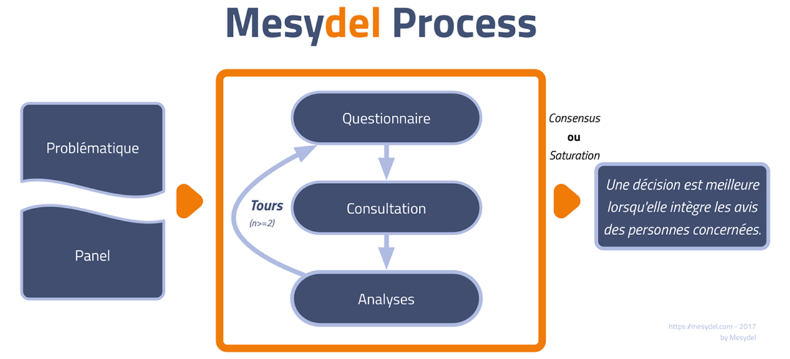

Dans le domaine de la santé, l’innovation est un axe-clé des activités de nombreux acteurs publics et privés. Elle peut se matérialiser notamment par l’émergence de nouveaux **outils**, de nouveaux **services** ou de nouvelles **collaborations**. Parmi les différents dispositifs existants pour développer et encourager l’innovation, les *Living Labs* ont une place de choix. Ceux-ci sont des structures qui facilitent l’innovation ouverte, fondée sur le partage, la collaboration et l’intelligence collective. Ils rassemblent différents acteurs, centrés sur l’expérience de l’utilisateur final ; ce dernier devient alors co-créateur tout au long du processus d’innovation.

> Dans un Living Lab, l'utilisateur final devient co-créateur de l'innovation.

Cette approche des Living Labs, par sa collaboration ouverte avec les utilisateurs finaux permet de **mieux comprendre**, et plus rapidement, **les usages recherchés**, à l’opposé des pratiques courantes de secret des grandes industries et des PME. Les services et produits ainsi créés répondent dès lors mieux aux besoins des usagers. Le modèle collaboratif par intégration des utilisateurs aux processus de conception des innovations donne accès aux entreprises, notamment aux PME, à des idées nouvelles et innovantes. Leur potentiel économique est renforcé, nouveaux produits, nouveaux emplois, améliorant le retour sur investissement des acteurs publics dans la recherche innovante et l’économie créative.

Les living labs sont largement soutenus au niveau européen, depuis le milieu des années 2000. Aussi, avec le soutien de la Région wallonne, [le centre de recherche Spiral](http://www.spiral.ulg.ac.be/) ([ULiège](http://uliege.be/)) et le CRIDS ([UNamur](http://unamur.be/)) a mené entre 2014 et 2017 un projet nommé INSOLL visant à **étudier les conditions de mise en œuvre d’une approche Living Lab pour favoriser l’innovation dans le secteur wallon de la santé**. Le projet est par ailleurs parrainé par le Centre d’Innovation Médicale (Scinnamic) et les sociétés Labage S.A. et Nomics S.A., actives dans le domaine de la recherche et de l’innovation en matière de santé.

Ce projet est divisé en six étapes successives :

1. un **état de l’art** de la pratique du living lab en matière de santé à travers le monde;
2. l’**étude approfondie** par observation participante **du Living Lab** LUSAGE/CEN STIMCO (Hôpital Broca, Paris), spécialisé dans le domaine des dégénérescences cognitives;
3. l’**analyse approfondie des besoins et attentes** des acteurs dans le secteur de l’innovation et de la santé en Région wallonne (plus de 40 entretiens semi-directifs);
4. une enquête Delphi en ligne en 2 tours utilisant **Mesydel**, auprès des acteurs du monde de l’innovation sociale et de la santé en Wallonie pour définir un premier "prototype" de **Living Lab idéal** ;
5. la conduite de **deux Living Labs “pilotes”** dans des contextes contrastés : (A) au sein de la Clinique de l’Espérance (projet d’information sur le milieu hospitalier par le jeu à destination des enfants) et (B) au sein de Symbiose Biomaterials (projet relatif à l’hygiène des mains à l’hôpital) ;
6. et la **construction de recommandations à destination des autorités régionales wallonnes**, notamment au travers d’ateliers participatifs.

L’enquête Mesydel a donc été une phase clé de ce processus de recherche, en visant à identifier les caractéristiques d’un living lab idéal au regard de ses missions, de ses services, de son business model, des acteurs impliqués ou encore de la gestion de la propriété intellectuelle.

Cette enquête a été menée en **deux tours**. Le premier tour de l’enquête visait à comprendre et à analyser les besoins de celles et ceux qui travaillent dans le secteur de la santé et qui s’engagent, de près ou de loin, dans l’évolution des pratiques et dans l’innovation, sous toutes ses formes. Le panel d’acteurs interrogés était composé de personnes travaillant dans des hôpitaux, à l’université, dans le secteur associatif et en entreprise, principalement dans des petites structures.

Les résultats du premier tour ont permis d’identifier :

- les **actions prioritaires** à mener dans le secteur de la santé;
- la **nature de l’innovation** et la manière d’y associer les destinataires ou les utilisateurs;
- ou encore les **obstacles à l’innovation et son financement.**

Ces éléments ont été synthétisés et mis en perspective pour concevoir le deuxième tour de l’enquête. Ce dernier a permis d’approfondir une série de questions tout en permettant aux répondants de se positionner sur des propositions d’autres participants. L’analyse a notamment permis de mettre en évidence une controverse entre deux visions du living lab :

- le Living Lab **comme service public, entièrement dégagé d’intérêts économiques** ;
- et le Living Lab **comme outil de création de valeur économique et sociale**.

Dans les deux cas, la dimension sociétale du Living Lab était présente, dans ses missions de santé publique — repenser le système des soins de santé et créer de nouvelles articulations d’acteurs pour plus d’efficacité, d’équité et d’humanité — et dans ses méthodes — réellement — participatives. La plupart des répondants étaient d’ailleurs favorables à la prise en compte d’indicateurs liés à l’impact sociétal pour évaluer les projets de R&D dans le domaine de la santé. Toutefois, dans la deuxième vision évoquée ci-dessus, il était admis d’une part, que des objectifs économiques et sociaux étaient conciliables dans un projet commun — et que cette association d’objectifs était même souhaitable — d’autre part, que des entreprises privées avaient un rôle à jouer dans un Living Lab Santé.

> Les données collectées et analysées grâce à Mesydel ont nourri une réflexion approfondie sur les modèles (économiques) de Living Lab Santé en Wallonie.

Combinées à d’autres éléments, elles ont guidé la création de scénarios de Living Lab en matière de santé. Ceux-ci traduisent, dans des situations concrètes et réalistes, un ensemble de recommandations liées notamment aux méthodes, à la gouvernance et au financement des Living Labs.

Parallèlement à l’élaboration des scénarios, un travail a été mené en vue de formuler des **recommandations générales**, en termes de politiques publiques, en termes de gestion du Living Lab et en termes de gestion de projets d’innovation.

Pour plus d’informations sur ce projet, le rapport final est disponible [ici](https://orbi.uliege.be/handle/2268/217394) et un guide des bonnes pratiques des living labs est disponible [ici.](https://orbi.uliege.be/handle/2268/220779)

**Pour plus d’informations sur les Living Labs en Wallonie en matière de santé, voyez également le site du** [**WeLL**](http://well-livinglab.be/)**, le Wallonia e-Living Lab.**
