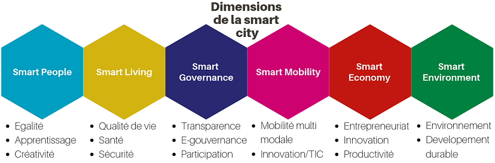

**Il est nécessaire de développer de nouvelles pratiques de gouvernance. Cet article présente comment le logiciel Mesydel peut être un outil participatif d’intelligence collective dans le cadre du développement d’une smart city.**

**Le développement du concept de smart city**

D’ici 2050, plus de deux tiers de la population mondiale vivra dans des villes selon un récent rapport des Nations Unies (Nations Unies, 2018). **Cette concentration urbaine va engendrer de nombreux défis**, sur le plan de la mobilité, de la gestion énergétique ou encore des habitudes de consommation. Pour faire face à ces défis, il apparait nécessaire d’adopter de nouvelles pratiques de gouvernance des villes.

En parallèle de cette croissance démographique, la technologie a connu un développement rapide et important. Cette dernière, à portée de main, s’avère omniprésente dans la vie quotidienne ; elle reconfigure la façon de vivre et de gérer la ville. Pour les habitants, elle facilite les échanges, réduit les distances et simplifie certaines tâches. **Dans la gestion d’une ville, de nouvelles technologies se développent également.** C’est dans ce cadre qu’émerge, dans de nombreuses villes, le concept de smart city, aussi appelée ville intelligente. **La smart city constitue une expression aux multiples facettes**. Six grandes dimensions « smart » peuvent être mises en avant et définissent assez bien ce que recouvre ce concept (Lombardi et al., 2012) :

Il est souvent tentant de réduire ce concept à l’utilisation de capteurs pour obtenir des données quantitatives et ainsi améliorer la qualité des services publics. Cela permet de collecter un important volume de données et d’obtenir une vision globale de la ville en temps réel. **Néanmoins, la technologie doit être considérée comme un moyen et non une fin : la smart city n’est pas uniquement technologique, elle est également sociale**. Elle s’appuie notamment sur une dimension “smart people” et sur une dimension “smart governance”, qui promeut les dispositifs participatifs. Ainsi, la smart city se met au service et inclut les citoyens avec pour projet d’améliorer sa qualité de vie et son environnement.

**Dans ce contexte, la participation citoyenne apparait comme un outil essentiel des smart cities**. Toutefois, intégrer le citoyen et prendre son avis en considération dans la gestion de la ville amène plusieurs avantages. D’abord, sur le plan politique, cela permet d’impliquer ce dernier dans la gestion publique. La légitimité démocratique des décisions locales ne s’appuie plus uniquement sur des élections organisées tous les six ans, mais sur des moments démocratiques plus fréquents, identifiés par des processus participatifs multiples (Rosanvallon, 2010). Ensuite, sur le plan social, il est important de créer des lieux où chaque citoyen peut prendre la parole et représenter certains intérêts. Cela permet également de donner la parole à des segments non représentés dans le champ politique traditionnel (Jacquet, 2017). Finalement, les décisions s’appuyant sur un plus grand nombre d’acteurs sont plus rationnelles, par leur prise en compte plus grande de la complexité de l’environnement (Jacquet, 2017). **Il est donc important d’inclure le citoyen dans la gestion urbaine à travers des processus participatifs. Le citoyen représente une source d’information importante et un acteur à ne pas négliger lors de la conception et la gestion d’une smart city** (Nguyen et al, 2017). Cette inclusion du citoyen demeure cependant parfois complexe à mettre en œuvre par les décideurs politiques.

## L’intelligence collective dans la smart city

À travers le monde, de nombreuses villes collectent des données auprès des citoyens, qu’il s’agisse d’informations relatives à des flux de mobilité, à des habitudes de consommation énergétique ou encore par rapport à leur expérience concrète face aux incivilités (ex. : signalement d’un déchet sauvage). Dans de nombreux cas, le rôle du citoyen est souvent passif ou réactif. Les données collectées sont ainsi principalement quantitatives et utilisées de manière agrégée. Néanmoins, au regard de différents aspects, **le concept de ville intelligente doit également s’appuyer sur l’intelligence collective**. La collectivité en mettant ses connaissances en commun a une plus grande capacité à répondre adéquatement à des problèmes complexes qu’un individu isolé (Salminen, 2012). Dans ce cadre, **il est essentiel de s’appuyer sur les opinions et l’expertise d’usager de chaque citoyen**. Cette démarche nécessite une collecte de données de nature plus qualitative, souvent sous forme de texte. Ces données doivent ensuite être rigoureusement analysées pour permettre de construire des projets et de répondre à des besoins sur la base de l’intelligence collective de ces citoyens. Certaines plateformes, comme Wikipedia ou Linux, en combinant l’utilisation des nouvelles technologies avec l’intelligence collective, ont prouvé la pertinence d’une telle approche (Malone et al, 2010). Cependant, la dynamique de groupe peut créer des biais lors d’un processus de délibération. Par exemple, la comparaison sociale peut amener les acteurs à se conformer aux idées des autres. De même, il existe entre certains acteurs autour d’une même table des rapports de pouvoir (un directeur et son employé, un élève et son professeur, par exemple), qui peuvent mener à adopter des positions différentes de celles qu’on défendrait dans d’autres contextes (en ce compris le silence) (Manin, 2011).

## Mesydel comme outil d’intelligence collective dans la smart city

Face à ces constats, **Mesydel propose un logiciel adapté à la mise en place d’un processus participatif et délibératif au niveau local et une expertise méthodologique basée sur plus de dix ans de recherche académique en sciences sociales**. Cela permet de construire du consensus et d’exploiter une forme d’intelligence collective. Lors d’une délibération, les citoyens interrogent leur vision d’un problème et mettent leurs compétences et leur vécu à contribution afin de construire une vision commune. Avec Mesydel, la démarche se déroule en ligne. La méthodologie proposée s’inspire de la méthode Delphi, reconnue sur le plan académique et facilitée par le logiciel. Basée sur plusieurs questionnaires successifs, elle permet d’identifier les éléments de consensus et de documenter les dissensus. Les participants répondent aux questionnaires en ligne quand ils le souhaitent, durant une période déterminée. Contrairement à des processus participatifs « en présentiel », les personnes n’interagissent pas directement entre elles, mais au travers d’un intermédiaire de confiance ; cela permet d’éviter des rapports de pouvoirs trop importants entre acteurs. Cet aspect est renforcé par la préservation de l’anonymat de chacun, ce qui assure une liberté d’expression optimale et un sentiment de confiance favorisant la participation.

**Dans le cadre de la smart city, beaucoup de processus participatifs se limitent à l’agrégation de votes individuels. Pour sa part, Mesydel se distingue en amenant les citoyens, peu importe leur horizon, à mener une réelle délibération et à la construction d’une solution commune**. L’approche permet d’éviter certaines dynamiques compétitives entre plusieurs projets sur lesquels on vote et qui pourraient être contreproductives à moyen terme, notamment en matière d’appropriation de la décision et de renforcement de la cohésion sociale. Négliger ces aspects pourrait entrainer le désintérêt de la communauté envers ces démarches participatives et le développement d’une smart city. Ainsi, Mesydel propose d’inclure davantage le citoyen dans une dynamique *bottom-up*, qui favorise la fédération d’une communauté autour du projet de smart city (Rodríguez Bolívar et al, 2019). Par ailleurs, l’approche proposée par Mesydel tient également compte du fait que la réalisation d’un processus participatif peut avantager certaines catégories sociales de la population (Blanc, 2012). L’accompagnement que propose Mesydel permet d’assurer une rigueur importante dans l’établissement d’un panel diversifié d’acteurs et dans la co-construction de solutions et de projets partagés par les citoyens.

## Quelques exemples de projets à mener au niveau local grâce à Mesydel

Mesydel peut apporter son soutien dans différents types de projets participatifs, qu’il s’agisse du réaménagement d’un espace public, de la mise en place d’un budget participatif, dans la rédaction d’un programme stratégique transversal (PST) ou dans la construction d’un diagnostic dans le cadre d’un plan communal.

- Dans **le réaménagement d’un espace public** (par exemple, une bibliothèque), Mesydel offre la possibilité de consulter en ligne les usagers afin de mieux identifier leurs habitudes, leurs profils ou même leurs opinions par rapport aux services proposés, à l’aménagement des lieux ou à d’autres thématiques. Ces derniers peuvent répondre directement sur leur ordinateur, leur téléphone ou leur tablette. Mesydel permet de réaliser un **diagnostic permettant de comprendre concrètement les besoins des différents bénéficiaires et d’établir une vision partagée de la problématique**.
- Dans le cadre d’un **budget participatif,** certaines entités locales souhaitent impliquer les citoyens en leur donnant l’opportunité de définir eux-mêmes des projets financés et réalisés par leur ville ou commune. Cependant, en cas de vote entre plusieurs projets, le processus devient compétitif et le résultat final peut engendrer de la frustration chez ceux dont le projet n’est pas retenu. Mesydel permet de dépasser cette compétition et de faire émerger un consensus entre les citoyens autour d’un projet commun. Grâce à sa procédure en plusieurs étapes, il est possible d’identifier les grandes problématiques rencontrées dans une localité puis de co-construire un projet commun intégrant les positions et besoins des participants. Ce processus en ligne permet aux citoyens de remettre en question leurs opinions en les confrontant aux réalités des autres, amenant à l’**émergence d’un consensus** (ou de la documentation d’un dissensus à trancher politiquement) **autour d’une problématique donnée**.
- Dans la rédaction d’un **programme stratégique transversal** (PST), il est souvent utile d’identifier des priorités. Pour la nouvelle législature de 2018–2024, les communes, CPAS et provinces sont désormais obligées de réaliser un PST. Planifier et prioriser des politiques n’est pas une chose simple à faire et ce processus s’avère de meilleure qualité lorsqu’il implique un nombre important d’acteurs diversifiés. Leurs expertises multiples permettent l’atteinte de priorités tenant compte de la complexité croissante des enjeux locaux. **Mesydel permet l’encadrement de cette réflexion et favorise l’émergence de priorités partagées à travers son logiciel.**
- Lors de la construction d’un diagnostic dans le cadre d’un **plan de cohésion sociale** ou de tout autre plan communal, il est nécessaire de disposer de nombreuses informations, sur des thématiques complexes. Par exemple, les plans de cohésion sociale visent à lutter contre les inégalités sociales. Cela implique de réfléchir à des questions relatives à la précarité, à l’accès à l’emploi ou au logement, enjeux complexes au niveau local. En outre, la mise en œuvre d’un tel plan rassemble de nombreux acteurs très différents. Ainsi, mener un débat afin de réaliser un diagnostic n’est pas simple à mettre en place. **Ici aussi, Mesydel apporte son expertise afin de construire un panel représentatif et d’encadrer la démarche de manière à faire dialoguer les acteurs et à mettre en commun leur expertise, en évitant les conflits.**

> *Si vous êtes intéressé par l’organisation de processus participatifs inclusifs et permettant la construction de solutions partagées par vos citoyens, n’hésitez pas à contacter notre équipe : team@mesydel.com !*

## Références

BLANC, Maurice, « Démocratie participative et classe moyenne », ERES, Espaces et sociétés, 2012/1, pp. 219–232.

JACQUET, Vincent. (2017). *Délibérer ou ne pas délibérer*. Thèse de doctorat défendue à l’ISPOLE. Louvain-la-Neuve, Université Catholique de Louvain, 265p.

MALONE, Thomas, LAUBACHER Robert et DELLAROCAS Chrysanthos, « The Collective Intelligence Genome », *MIT Sloan Management Review*, Vol. 51, no. 3, 2010, pp. 21–31.

MANIN, Bernard, « Comment promouvoir la délibération démocratique ? Priorité du débat contradictoire sur la discussion », *Raisons politiques*, vol. 42, no. 2, 2011, pp. 83–113.

NGUYEN, Catherine, BLEUS, Hélène, VAN BOCKHAVEN, Jonas, « smart city, le guide pratique », *Smart City Institute*, 2017, 72 p.

ROSANVALLON, Pierre, 2010, *La légitimité démocratique : Impartialité, réflexivité, proximité*, Paris, Points.

SALMINEN, Juho, « Collective intelligence in humans: a literature review », Lappeenranta University of Technology, 2012, 8p.

[https://www.un.org/development/desa/publications/world-population-prospects-the-2017-revision.html](https://www.un.org/development/desa/publications/world-population-prospects-the-2017-revision.html)

[https://www.un.org/development/desa/fr/news/population/2018-world-urbanization-prospects.html](https://www.un.org/development/desa/fr/news/population/2018-world-urbanization-prospects.html)
