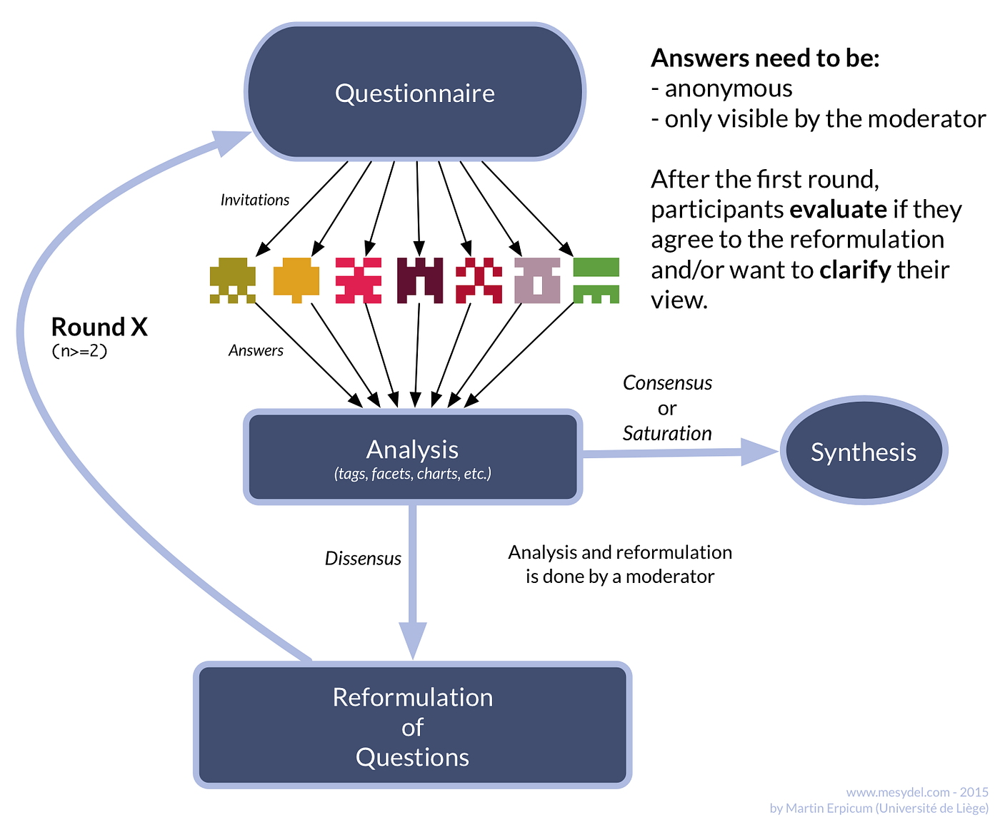

## **Qu’est-ce que la méthode Delphi et à quoi sert-elle ?**

La méthode Delphi est une technique de communication structurée développée à l’origine comme une méthode de prospection systématique et interactive se basant sur un panel d’experts.

> “Outil prospectif, de type quali-quantitatif, consistant en l’agrégation d’opinions d’(experts), la méthode Delphi est une méthode systématique d’interrogation formelle par questionnaire faisant appel au jugement intuitif et aux connaissances d’un panel […] dispersés géographiquement, servant à faire des prévisions par l’expression d’opinions rationnelles sur des questions où il n’existe pas de réponse absolue ” — Ieroncig, 1983

Ses applications sont variées, tant au niveau du domaine — médecine, psychologie, sciences de l’éducation, management, économie, sciences sociales, etc. — que de l’objectif de la consultation : innovations technologiques, anticipation d’un marché ou d’une tendance, prospection stratégique, gestion participative, design participatif, etc.

## **Les caractéristiques principales de la méthodologie**

La méthode Delphi prend habituellement la forme d’un questionnaire écrit. Cela permet une consultation et un débat anonyme et indépendant, évitant de ce fait certains écueils des confrontations de visu, à la fois sur le plan social (ex: les relations de pouvoir dans un groupe) et sur le plan pratique (activité chronophage, spécialement quand il s’agit de participants géographiquement dispersés). Les réponses sont visibles uniquement par le modérateur et non par les participants, afin d’éviter les biais d’auto-modération.

En résumé, la méthode permet une consultation itérative d’experts (la notion d’expert s’élargit souvent à celle de *stakeholder*), sur le mode de l’écrit, dans le but d’obtenir une réponse de plus en plus consensuelle (l’objectif final étant de se rapprocher d’un consensus entre les experts). Les experts, constitués d’une dizaine voire parfois de centaines de personnes, sont invités au fur et à mesure des tours (2, 3 ou plus) à se positionner par rapport à une question en fonction des réponses des autres participants. Toutes les réponses se font selon le principe de l’anonymat et de l’indépendance des jugements. Dans la forme, la présentation des questions peut varier : il peut s’agir de questions ouvertes et/ou plus fermées (qualitatives et/ou quantitatives).

**Consensus/dissensus**

La méthode a été construite pour encourager le consensus sur des thématiques particulières comme la définition de priorité, la prévision technologique, ou les décisions sur certaines options techniques ou médicales. Plus précisément, la méthode Delphi crée des conditions qui sont favorables à une convergence d’opinions, tout en permettant de discerner clairement les points de dissensus. L’étude de ces derniers est importante, dans la mesure où elle légitime la méthode et mène souvent à redéfinir le problème initial, en favorisant à nouveau l’atteinte d’un consensus. Aussi, la caractéristique clé de la méthode Delphi est son processus de feedback contrôlé au travers de plusieurs tours.

**Tours multiples et feedbacks contrôlés**

À l’opposé des enquêtes classiques, la méthode Delphi consiste en une consultation itérative et interactive : un panel de participants est consulté au cours de plusieurs tours, et dans chacun de ces tours, le panel reçoit un retour du tour précédent tout en devant prendre à nouveau position au regard des résultats précédents (processus de feedback contrôlé). En plus du fait de donner leur avis, les participants doivent fournir des feedbacks complémentaires. Il est également important de préserver l’anonymat des répondants. En combinant des questions fermées (ex : choix multiples) et des questions ouvertes, la méthode Delphi produit à la fois des résultats quantitatifs et qualitatifs.

## **Dans quels cas utiliser la méthode Delphi ?**

Processus didactique, la méthode Delphi a été conçue dans le but d’offrir les avantages d’une mise en commun et d’un échange d’opinions, de manière à ce que les personnes interrogées puissent découvrir les opinions des autres, sans cette influence excessive que l’on rencontre parfois dans les face à face conventionnels (qui sont généralement dominés par ceux qui parlent le plus fort ou ont le plus de prestige). La technique permet aux participants de traiter d’un problème complexe de manière systématique. Lors de chaque tour, les informations pertinentes sont partagées et enrichissent les connaissances des membres du panel. Ceux-ci sont alors à même de faire des recommandations qui se fondent sur des informations plus complètes.

Habituellement, une ou plusieurs de ces caractéristiques entraînent le besoin de faire appel à la méthode Delphi :

- **Subjectivité du sujet abordé :** le problème ne se prête pas à des techniques d’analyse précises mais peut tirer profit de jugements subjectifs sur une base collective.
- **Besoin de faire dialoguer des personnes issues de parcours différents :** les personnes requises pour participer à l’examen d’un problème vaste ou complexe peuvent ne disposer d’aucune expérience en communication et présenter différents parcours professionnels avec leurs expertises et compétences.
- **Contraintes logistiques :** le nombre de personnes requises est trop élevé pour interagir efficacement dans le cadre d’un échange en face à face.
- **Besoin de préparation avant une réunion :** l’efficacité des réunions en face à face peut être accrue par un processus de communication collective supplémentaire. Outil d’aide à la décision, la méthode conduit, implicitement ou explicitement, à la création d’un consensus quant aux résultats de la démarche (choix, recommandations, avis ou modalités d’action).
- **Acceptabilité sociale des décisions :** les désaccords sont tellement importants ou politiquement inacceptables que le processus de communication doit être arbitré et/ou l’anonymat doit être garanti. La procédure peut également avoir pour objectif une prise de conscience collective auprès du public concerné ainsi que des experts académiques, des industriels ou encore des agences publiques.
- **Recueil d’un pluralité d’opinions :** l’hétérogénéité des participants doit être préservée afin de garantir la validité des résultats, c’est-à-dire afin d’éviter toute domination imposée par le nombre ou par une forte personnalité. L’émergence de la plus grande diversité possible d’opinions est favorisée en même temps qu’une prise de conscience de la convergence et/ou divergence de ces opinions.
- **Exploration de scénarios possibles et prospective :** la participation favorise la réduction de l’incertitude et facilite la prise de décisions en contexte complexe et/ou d’incertitude. Les acteurs associés au panel sont mobilisés autour de scénarios futurs à la fois possibles et souhaitables. Ils peuvent les co-construire, ou se positionner par rapport à des futurs prédéfinis, se projetant au sein de ceux-ci, dans l’objectif d’établir un plan d’action. La méthode autorise et favorise donc le déplacement du débat vers la sphère publique ; elle permet ainsi d’organiser le passage de la réflexion collective à l’action commune, via la définition et la coordination de l’action concertée.
- **Effet d’apprentissage :** la conduite d’une enquête en plusieurs tours favorise l’apprentissage auprès des participants mais aussi l’apprentissage relatif à la problématique traitée. La consultation peut par exemple être une première approche d’un débat contradictoire au sein du panel avant diffusion vers l’espace public.
