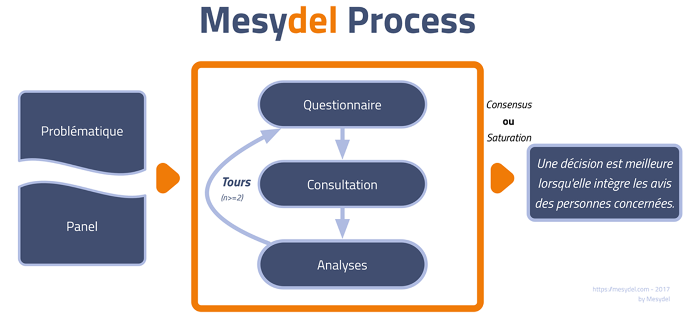

Le 25 janvier 2018, le groupe Carrefour annonçait la suppression de 1233 emplois en Belgique. Le choc était d’autant plus fort que les travailleurs du groupe avaient déjà connu pareille restructuration en 2010, quand l’entreprise avait annoncé la suppression de plus de 1700 emplois et la fermeture de 14 hypermarchés en Belgique.

A la suite de cette annonce, je publiais le 31 janvier dans L’Echo une carte blanche intitulée de manière provocante « Carrefour n’a pas pris le temps de penser à son avenir. Qui sera le suivant ? ». J’y soulignais que **les travailleurs ont payé le prix d’une réflexion limitée, sinon absente, sur l’avenir à long terme** de leur entreprise et sur l’évolution des tendances au sein de la grande distribution.

Dans les deux cas, l**e management du groupe a justifié sa décision par un changement des habitudes de consommation**, poussé par le développement de l’e-commerce, par le redéploiement des magasins de proximité et par la volonté des consommateurs de manger bio, frais et/ou local.

**Il ne s’agit pourtant nullement de tendances nouvelles** : ces évolutions sociétales sont observables depuis plus de dix ans. La justification invoquée par le groupe Carrefour tient donc, au mieux, d’une attention trop limitée accordée à ces tendances dans la dernière décennie.

Ce manque d’attention n’est pas surprenant en soi. **Il est en effet lié au mode de fonctionnement de nombreuses entreprises qui ne prennent plus la peine de penser leurs stratégies sur un temps long.**

Plus qu’un plan établi en réaction à des tendances auxquelles le groupe ne s’est pas préparé, ce qu’il faut à Carrefour et à toute entreprise active dans un secteur ultra-concurrentiel, c’est une réflexion prospective rigoureuse et inclusive qui permette de penser le temps long dans un environnement complexe.

**Trois impératifs sont nécessaires à l’avènement d’une telle réflexion prospective en entreprise.**

**Premièrement**, les entreprises doivent **entrer dans une démarche intellectuelle orientée vers le futur à long-terme**, sortant des cycles budgétaires annuels liés au versement des dividendes. Pour mettre en place une telle démarche, il est central que les entreprises, à l’instar des pouvoirs publics, investissent dans des ressources humaines dédiées et formées à ce type de réflexions.

**Deuxièmement**, les entreprises se doivent de c**onsidérer leur avenir de manière systémique**, en prenant compte les dimensions multiples qui composent leur contexte. Ces dimensions sont structurelles ou conjoncturelles, centrales ou périphériques à l’activité, globales ou locales, économiques ou sociales. Il est ainsi nécessaire de prendre en compte, en matière de grande distribution, à la fois le changement des modes de consommation au niveau local, dans les villes et les campagnes, mais de penser également les évolutions dans le contexte globalisé du commerce international.

**Troisièmement**, **l’activité prospective d’une entreprise se doit d’être inclusive.**Il est essentiel de mobiliser l’intelligence collective pour construire la stratégie de tels groupes. Dans un groupe comme Carrefour, les travailleurs sont souvent les premiers consommateurs. Leurs avis comptent, d’autant plus qu’ils permettront sans aucun doute d’apporter des perspectives diversifiées et d’enrichir celles du management.

Dans un monde économique en mutation(s) permanente(s), il importe aux entreprises de **ne pas adopter une posture de réaction face à ces changements**. Cette posture résolument prospective et proactive, considérant un horizon temporel plus large et prenant en compte les perspectives des personnes directement concernées, aurait sans doute pu éviter les récents drames sociaux.

**Des outils existent pour mener ces exercices de prospective systémique tout en favorisant la participation à grande échelle et la co-création de solutions nouvelles pour un futur qui prend mieux en compte l’avis des personnes concernées.**Ils sont développés dans des universités, dans des administrations ou dans des associations. En ce sens, il est essentiel de revoir les dimensions prises en compte dans ces réflexions stratégiques pour reconstruire leur avenir.

Parmi ces solutions, nous pensons que **Mesydel est une solution efficace pour mener ce type de démarche**. Pour rappel, Mesydel est un outil de consultation en ligne qui implémente les principes d’une méthode particulière ([la méthode Delphi](https://blog.mesydel.com/la-m%C3%A9thode-delphi-un-outil-puissant-dintelligence-collective-ea58d08aa68a)) et facilite l’organisation et l’analyse de ce type d’enquête.

## **Pourquoi Mesydel est un outil approprié dans ce cas précis ?**

**Différentes difficultés méthodologiques et logistiques**se posent généralement avec les méthodes traditionnelles de consultation. Trois sont listés ci-dessous :

- Le cloisonnement : certaines méthodes, comme les sondages classiques, peuvent entrainer un certain cloisonnement des positions des acteurs, dans le cadre de la construction d’une vision partagée. Les différents participants n’interagissent que de manière limitée et non-systématique.
- Les contraintes logistiques : celles-ci sont souvent des aspects centraux d’un processus participatif. En effet, dans certaines entreprises (comme dans tout autre contexte), il est difficile de rassembler au même endroit et au même moment différents participants, du fait de leur agenda respectif et de leur lieu de travail.
- La contrainte sur la liberté d’expression : au cours d’un exercice participatif « physique » comme un atelier, il peut parfois exister des rapports de force entre les participants qui peuvent limiter la liberté de parole de certains d’entre eux. Par exemple, si un employé participe au même atelier que son supérieur direct, il pourrait se sentir contraint et ne pas exprimer son point de vue de manière libre.

**Mesydel permet de répondre à ces trois grandes contraintes (cloisonnement, contraintes logistiques et restriction de la parole) qui sont des difficultés inhérentes aux processus participatifs.**

**Premièrement**, **Mesydel permet de décloisonner les débats** par l’organisation de plusieurs questionnaires successifs. Le schéma ci-dessous explicite bien le processus d’une enquête de type Delphi :

Chaque questionnaire permet de collecter une série d’informations et de données qui sont analysées par le(s) modérateur(s) de l’enquête. Ce dernier détermine si un consensus est atteint sur l’ensemble des questions. Si cela n’est pas le cas, un nouveau questionnaire est organisé. Au cours de celui-ci, les participants prennent connaissance des résultats du questionnaire précédent et sont appelés à se positionner sur une série de thématiques en lien avec ces résultats. Cette itération permet aux participants de prendre conscience du positionnement du groupe et de créer un “esprit de groupe” afin de construire ensemble un consensus sur un aspect donné.

Dans certains cas, il est possible qu’aucun consensus n’émerge, même après plusieurs tours de questionnaire. L’enquête permet dès lors d’identifier les points de dissensus afin de les explorer plus en détail et de prendre une décision à leur sujet. Ce processus est inspiré de la méthode Delphi qui est implémentée au sein de Mesydel.

**Deuxièmement, Mesydel est un outil informatique qui permet de mettre en interaction des participants dont les agendas ne sont pas concordants ou qui sont géographiquement trop éloignés pour une rencontre physique.** Un questionnaire est en général ouvert entre 2 à 3 semaines, laissant la possibilité à chacun d’y répondre au moment qui lui convient le mieux. A titre d’exemple, Mesydel est régulièrement utilisé pour consulter les acteurs d’une politique publique menée sur un territoire, qu’il s’agisse de bibliothécaires, de spécialistes de l’alphabétisation ou de responsables en matière de planification d’urgence dans des sites à haut risque chimique.

**Finalement, Mesydel propose des consultations où l’anonymat est un enjeu central.**Dans ce contexte, l’argument d’un participant primera toujours sur son positionnement hiérarchique ou social. Chaque participant est ainsi libre de s’exprimer sans crainte.

## **Un processus participatif et interactif particulier**

Utiliser Mesydel pour construire une vision partagée sur le futur d’une entreprise peut s’inspirer d’un tel processus*. En effet, il est possible de définir un *design*d’enquête en trois tours de questionnaire qui permet de construire la vision d’une entreprise. Chaque tour consiste en une phase particulière de la construction de la vision commune.

**Ces trois phases sont l’exploration, la construction et la validation.**

**La phase d’exploration** vise à établir un diagnostic de la situation initiale en identifiant les dimensions centrales au futur de l’entreprise et en évaluant leur état actuel. Elle permet également de mettre en évidence les différents souhaits participants quant à leur entreprise idéale à l’horizon temporel défini.

**La phase de construction** permet quant à elle de dépasser le diagnostic et autorise une première interaction forte entre les participants, permettant à chacun de se positionner en fonction d’une meilleure connaissance des désirs d’autres participants quant au futur de l’entreprise. Cette phase permet à chacun de s’accorder sur des principes généraux et sur des valeurs qui encadreraient l’entreprise, tout en facilitant la recherche constructive de solutions concrètes de mise en œuvre de ces principes et valeurs.

**La phase de validation**permet de confirmer certaines hypothèses et d’asseoir le consensus, tant sur les principes et les valeurs que sur leur matérialisation concrète, ou de mettre en lumière des points de dissensus dont il faut être conscient.

**Bien sûr, la réalité est plus complexe et ce simple processus nécessite d’être adapté aux besoins d’une entreprise particulière.**De plus, les trois phases peuvent parfois se superposer au sein d’un même questionnaire en raison d’un contexte spécifique.

**Si vous souhaitez en savoir plus sur Mesydel et ses activités,**[**visitez notre site web**](http://www.mesydel.com/)**!**

*Cet article n’aborde pas une série d’autres questions méthodologiques relatives au choix du panel de participants, à la période d’organisation de l’enquête, à l’horizon temporel vers lequel l’entreprise souhaite se projeter ou les activités préparatoires au lancement de l’enquête. Ces multiples questions ne doivent pas être éludées et doivent être systématiquement considérées par les personnes en charge de l’enquête.
