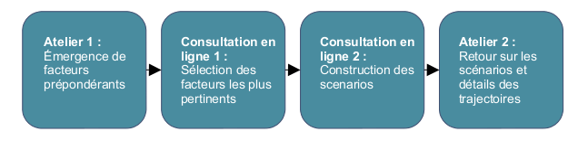

L’**Institut de l’Environnement et du Développement Durable (IMDO)** de l’Université d’Anvers avait besoin de mener une étude interdisciplinaire de prospective pour explorer des scénarios énergétiques sur le long-terme. L’objectif était d’intégrer des apports sur les dynamiques des systèmes énergétiques venus de l’ingénierie, de l’économie, des sciences politiques, de la sociologie et de l’éthique. Afin de réaliser cet exercice et de faciliter la dimension participative du projet, un partenariat avec Mesydel a été mis en place :

- Consensus sur les 20 facteurs les plus importants impactant le développement du système de l’énergie
- Co-construction interdisciplinaire de 3 scénarios de long-terme sur le futur de l’énergie
- Exploration de nouvelles trajectoires possibles pour atteindre 8 objectifs spécifiques en 2050
- Évaluation des conséquences et de l’implication de ces scénarios grâce à un cadre d’évaluation multi-critères

## **Notre partenaire**

L’**Institut de l’Environnement et du Développement Durable (IMDO)** de l’Université d’Anvers est le principal coordinateur du projet de recherche SEPIA, *Sustainable Energy Policy Integrated Assessment — A normative contribution to decision support*. Le projet SEPIA s’est déroulé de janvier 2008 à décembre 2010. The centre de recherche IMDO conduit une recherche multidisciplinaire et des programmes de formation qui visent à appuyer les challenges complexes auxquels font face la société, l’industrie et les autorités à propos des questions de durabilité. La nature interdisciplinaire et le besoin de co-construction de cet exercice de prospective faisaient de Mesydel un partenaire essentiel pour faciliter la phase participative du projet SEPIA.

## **Contexte**

Comme tous les pays industrialisés, la Belgique est actuellement enfermée dans un système économique très dépendant du carbone et de l’énergie fossile. Les technologies, institutions, infrastructures et réseaux les plus importants se sont construits dans ce contexte particulier. En gardant cela en tête, pour atteindre un futur énergétique durable et moins dépendant du carbone il est nécessaire d’acquérir de **nouvelles façons de penser**, à la fois en terme de système énergétique que des niveaux de demande et de la façon dont cette demande sera couverte.

Cette évolution demande le développement de scénarios énergétiques de long-terme, nécessaires pour soutenir la construction de décisions politiques solides et cohérentes, pour orienter les investissements de long-terme et pour anticiper les changements sociétaux nécessaires. Cela représente un énorme challenge qui doit se baser sur des **informations scientifiques stratégiques**. Ce support scientifique d’aide à la décision sur le développement durable d’un territoire est assez différent d’une science politique plus traditionnelle. En effet, en raison de son caractère normatif, il y a une réelle connection avec des schémas de valeurs imposées sur le long-terme. Il est donc nécessaire d’impliquer un large panel d’acteurs scientifiques et sociaux pour se mettre d’accord sur les développements les plus pertinents.

Le projet SEPIA répond à ces besoins dans le domaine des politiques énergétiques de long-terme. C’est un projet interdisciplinaire qui vise à intégrer les apports sur les dynamiques des systèmes énergétiques de plusieurs disciplines : ingénierie, économie, sciences politiques, sociologie et éthique. L’objectif était d’aboutir à des **scénarios possibles de long-terme pour le futur des politiques énergétiques**, chacun d’eux répondant à 8 objectifs de durabilité pour 2050.

Même si une partie des résultats du projet sont spécifiques au contexte belge, le projet est englobé dans le contexte plus large des débats sur la gouvernance mondiale et européenne des systèmes énergétiques.

## **L’intervention de Mesydel**

Pour l’exercice de prospective, deux groupes de participants ont été créés : un Groupe de Construction des Scénarios (SBG) et un Panel de Parties Prenantes (SHP). Le processus comprenait 4 étapes. Mesydel a été utilisé dans les étapes 2 et 3 afin de choisir/classer des facteurs et de construire des canevas de scénarios avec le SBG.

1. **Collecte et élaboration de facteurs qui influencent le développement du système énergétique :** Un premier atelier avec les deux panels SBG et SHP a mené à la définition et à l’exploration de 50 facteurs essentiels ayant un impact sur le système énergétique. Parmi ces 50 facteurs, les panels ont sélectionné les 22 plus important, en fonction des objectifs de développement fixés pour 2050.
2. **Consultation internet pour la sélection des 6 facteurs les plus significatifs :** la consultation en ligne s’est déroulée avec le panel SBG. Elle a été utilisée pour atteindre une analyse structurelle des interdépendances entre les facteurs, en utilisant une matrice englobant les 22 facteurs. Les facteurs ont ensuite été classés en fonction de leurs relations aux autres : facteurs déterminants, stratégiques, régulatoires, dépendants ou autonomes. 6 facteurs significatifs ont été sélectionnés en fonction de cette classification.
3. **Co-construction des scénarios avec le panel SBG :** Un deuxième tour de questions a permis une réelle co-construction des canevas de 3 scénarios en utilisant les 6 facteurs sélectionnés à l’étape précédente. Une approche mathématique de construction aurait été trop consommatrice en temps et en ressources, c’est pourquoi une approche plus intuitive a été privilégiée. Les experts ont regroupé des hypothèses cohérentes qui permettent d’atteindre les 8 objectifs de durabilité. Les combinaisons d’hypothèses ont formé la base des 3 scénarios possibles. Chacun d’eux a ensuite été complété par des hypothèses sur les autres facteurs et en retraçant les interventions politiques nécessaires au niveau national.
4. **Discussion de feedback sur les scénarios obtenus :** Un second atelier a été mené de façon à revenir sur ces résultats obtenus en ligne. Les deux panels SHP et SBG ont été impliqués. L’atelier a permis de construire un arbre de valeur et des fiches explicatives pour chaque indicateurs, sources de données et mesures utilisées. Le fil conducteur de chaque scénario a ainsi été discuté et enrichi.

## **Resultats**

La consultation a été menée avec un large groupe d’experts et de décideurs politiques. Ce groupe était relativement fragmenté, chacun ayant des agendas chargés, des attentes spécifiques et des critères de performances différents. Cependant Mesydel a contribué à cet important exercice de prospective par l’atteinte de trois principaux résultats :

- **Une aide à la décision entre la science et la politique :** une évaluation de la durabilité des stratégies politiques en matière d’énergie a été réalisée à l’interface entre la construction de théories scientifiques et les contraintes pratiques et politiques. Cela signifiait entre autres des accords sur une gouvernance inclusive et rigoureuse basés à la fois sur une cohérence scientifique, une légitimité politique et une opérationnalisation des dispositifs.
- **Exploration de nouvelles idées et scénarios et atteinte d’un consensus :** grâce à l’outil informatique, le très large panel d’acteurs a été capable de prendre des décisions en fonction des règles de consentement mutuel et d’une délibération consensuelle afin de résoudre les conflits autant que possible. De plus, cela a permis l’émergence d’idées et de ressources nouvelles pour gérer la problématique traitée.
- **Contribution à la méthodologie de prospective dans le champ de l’évaluation de durabilité :** la méthodologie utilisée s’est inspirée des apports de l’économie écologique, de l’analyse des décisions et des études sur la science et la technologie. Cette expérience a été très utile pour aborder un problème complexe et multidimensionnel de long-terme, c’est-à-dire qui met en jeu des informations imprécises, de l’incertitude et des valeurs incommensurables. Dans ce cas précis le poids d’une preuve scientifique au sens strict est trop lourd, et l’approche bénéficie donc fortement d’une méthode plus intuitive basée sur la consultation d’un panel large et diversifié.

## Contact

**Mesydel.com**

## Références

Documentation du projet: [http://www.belspo.be/belspo/fedra/proj.asp?l=en&COD=SD%2FEN%2F07A#docum](http://www.belspo.be/belspo/fedra/proj.asp?l=en&COD=SD%2FEN%2F07A#docum)
